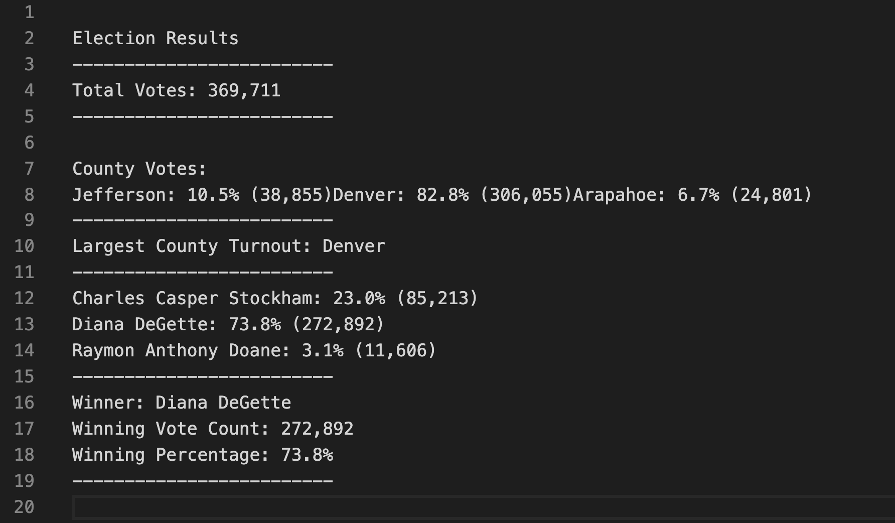
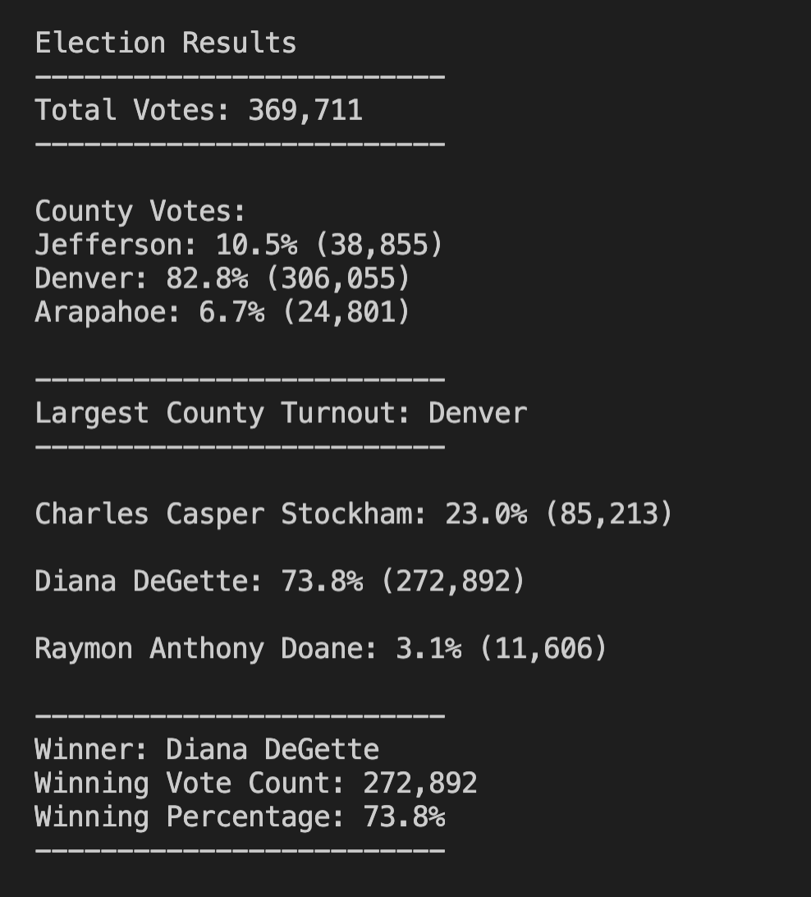

# Election_Analysis
## Project Overview
A Colorado Board of Elections employee has given you the following tasks to complete the election audit of a recent local congressional election.

1. Calculate the total number of votes cast.
2. Get a complete list of candidates who received votes.
3. Calculate the total number of votes each candidate received.
4. Calculate the percentage of votes each candidate won.
5. Determine the winner of the election based on popular vote.

## Resources
* Data Source: [election_results](Resources/election_results.csv)
* Software: Python 3.7.6, Visual Studio Code 1.50.1

## Summary
The analysis of the election shows that:

* There were 369,711 votes cast in the election.
* The candidates were:
    * Charles Casper Stockham
    * Diana DeGette
    * Raymon Anthony Doane
* The candidate results were:
    * Charles Casper Stockham received 23.0% of the vote, and 85,213 total votes.
    * Diana DeGette received 73.8% of the vote, and 272,892 total votes.
    * Raymon Anthony Doane received 3.1% of the vote, and 11,606 total votes.
* The winner of the election was:
    * Diana DeGette, who received 73.8% of the vote and 272,892 total votes.

## Challenge Overview
### Overview of Election Audit

A Colorado Board of Elections employee has given you the following tasks to complete the election audit of a recent local congressional election.

1. Get a complete list of counties that received votes.
2. Calculate the total number of votes each county received.
3. Calculate the percentage of votes each county received.
4. Calculate which county received the greatest number of votes.

Output the calculations for the election audit to the text file: [election_analysis](analysis/election_analysis.txt)

Format the output to the text file to look like this: 

Or alternatively, to look like this on a Mac Terminal:  PIC

### Election Audit Results

The analysis of the election shows that:

* The counties were:
    * Jefferson
    * Denver
    * Arapahoe
* The county results were:
    * Jefferson received 10.5% of the vote, and 38,855 total votes.
    * Denver received 82.8% of the vote, and 306,055 total votes.
    * Arapahoe received 6.7% of the vote, and 11,606 total votes.
* The county that received the greatest number of votes was:
    * Denver, which received 82.8% of the vote and 306,055 total votes.

## Challenge Summary

The script used to perform the Colorado Board of Elections audit can be found here: [PyPoll_Challenge](PyPoll_Challenge.py)

With some modification, the script can be used to perform the same audit calculations for other elections.

If a different data source for a different election was used (a new CSV file for example) we would simply modify the pathway to that data source contained in the variable "file_to_load". Then make sure the correct columns in the CSV file were called for the variables " candidate_name = row[index #]" and "county_name = row[index #]".